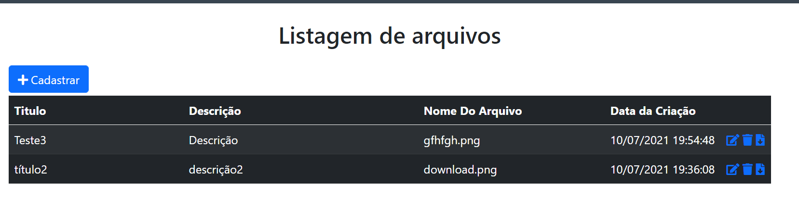

# DocspiderUploadDownload

Projeto de CRUD de um arquivo para teste técnico da empresa Docspider.


> "Crie uma aplicação que permita realizar o upload de documentos.  
A aplicação deverá permitir: cadastrar, listar, visualizar, editar e excluir documentos."

<br>


<p align="center">    
    
</p>

<br>

## Regras de Negócio

* A tela de cadastro deve conter os seguintes campos: Titulo, Descrição, Arquivo, Nome do Arquivo.
* A tela de listagem deve conter os seguintes campos: Titulo, Descrição, Nome do Arquivo, Data e Hora de Criação e também um botão para download do arquivo.
* A tela de visualização deve exibir todos os campos e também permitir o download do arquivo e exclusão do documento;
* A tela de edição deve permitir editar todos os campos e também permitir o download do arquivo e exclusão do documento;
* Não deve permitir cadastrar mais de um documento com mesmo título
* O título deve possuir no máximo 100 caracteres
* A descrição deve possuir no máximo 2000 caracteres

## Pré-Requisitos
* Visual Studio
* Sql Server
* .net Core 3.1

## Rodar o projeto

* Crie a tabela Upload
```bash  
  CREATE TABLE [dbo].[Upload](
	[IdUpload] [int] IDENTITY(1,1) NOT NULL,
	[Titulo] [varchar](100) NULL,
	[Descricao] [varchar](2000) NULL,
	[Nome_Do_Arquivo] [varchar](100) NULL,
	[DataCriacao] [datetime] NULL,
	[Arquivo] [varbinary](max) NULL,
	[ContentType] [nvarchar](200) NULL
) ON [PRIMARY] TEXTIMAGE_ON [PRIMARY]
```
* Definir o appsetting.json com as credencias do banco
* Rode o projeto no IIS Express


## Authors

- **Sylvio Labriola** - [TricksterNoir](https://github.com/TricksterNoir)
